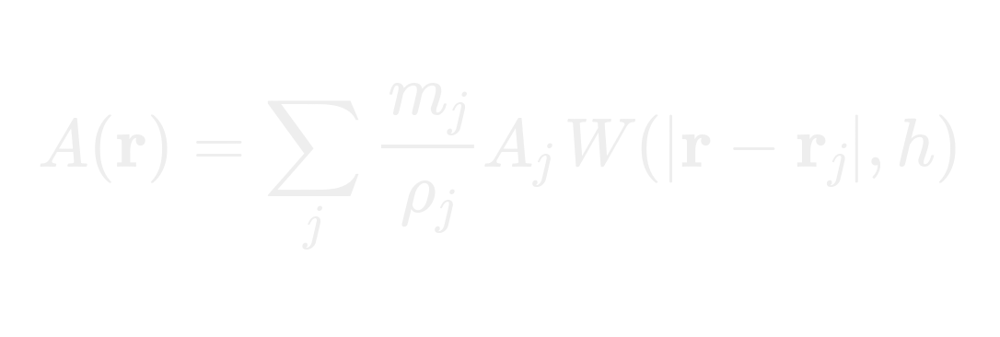
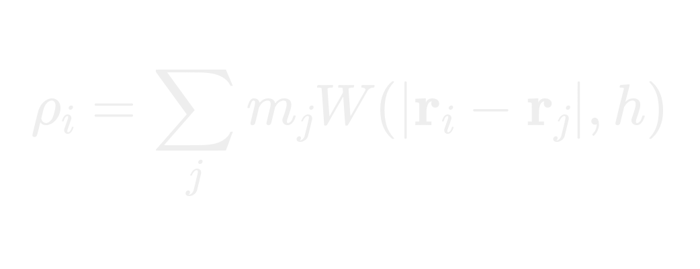
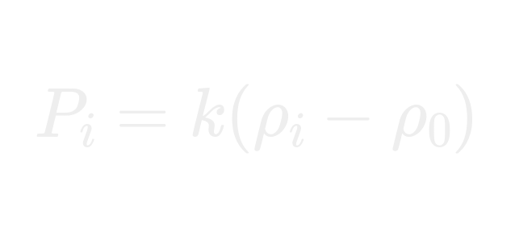
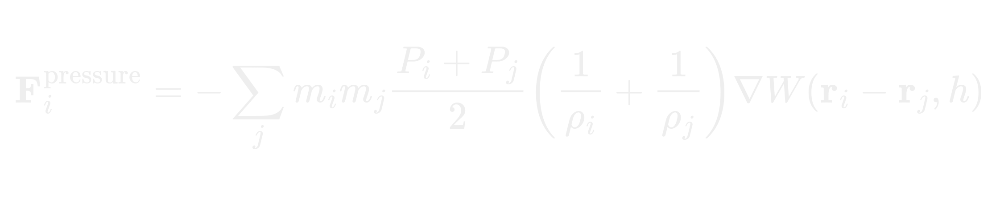
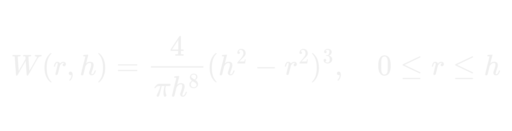
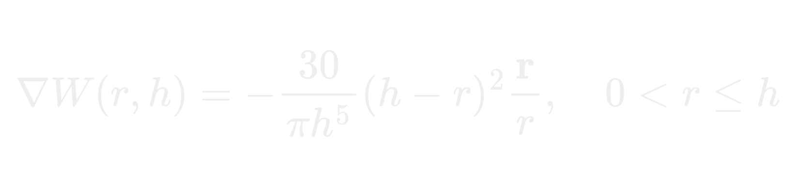

# Particle Simulation using SPH (Smooth Particle Hydrodynamics)

This project is a **2D particle-based fluid simulation** implemented in C++ using **SDL3** and **OpenGL**. The simulation demonstrates the dynamics of particles interacting under pressure, gravity, and user-applied forces. It also includes a GUI via **ImGui** for live tweaking of parameters.

## Formula Used

### 1. SPH Interpolation

SPH allows us to estimate any field quantity (e.g., temperature, velocity, or some property) at a given point using neighboring particles:



- A(r) → interpolated property at point *r*
- A(j) → property of particle j
- m(j) → mass of particle j  
- ρ(j) → density of particle j
- W(|r - r(j)|, h) → smoothing kernel (Poly6 in 2D)  
- h → smoothing radius 

**Example from the simulation code:**

```cpp
for (int i = 0; i < numParticles; i++) {
    glm::vec2 vec = point - position[i];
    float dst = glm::length(vec);

    if (densities[i] > 0.0f && dst < smoothingRadius) {
        float weight = smoothingKernel(smoothingRadius, dst);
        property += -(properties[i] * (mass / densities[i])) * weight;
    }
} 
```

### 2. Density Calculation

For each particle, density is calculated based on neighboring particles within the smoothing radius `sr`:



- ρ(i) : density of particle i
- m(j) : mass of neighboring particle j (here `1.0`)  
- *W* : smoothing kernel function  
- h : smoothing radius (`smoothingRadius`)  


### 3. Pressure Calculation

Pressure is calculated from density deviation from a target density:



- P(i) : pressure of particle i  
- k : pressure multiplier (`pressureMultiplier`)  
- ρ(o) : target density (`targetDensity`) 

### 4. Pressure Force

The pressure force applied to each particle is:



- ∇W : gradient of the smoothing kernel.

### 5. Smoothing Kernel (Poly6 Kernel in 2D)

The smoothing kernel describes how much a particle influences its neighbors based on distance. In SPH, every property (like density, pressure, or force) is weighted by this kernel.

We use the **Poly6 kernel** for 2D:



- r = |r(i) - r(j)|  
- h: smoothing radius  

Gradient of the kernel:



This ensures smooth forces and prevents particle clustering.

## User Controls

- **Mouse Left Drag**: apply positive pressure/force to push particles.  
- **Mouse Right Drag**: apply negative pressure/force to pull particles.  
- **Middle Click**: prints density and pressure of clicked location. 

## Dependencies

- **C++17** or higher  
- **SDL3**  
- **OpenGL 3.3+**  
- **GLAD**  
- **GLM**  
- **ImGui**  

## Running the Simulation

1. Clone the repository.
2. Build using your favorite C++ compiler with SDL3, OpenGL, GLAD, and GLM linked.
3. Run the executable to see a real-time particle simulation.


## Notes

- The simulation uses **spatial hashing** for efficient neighbor search, reducing the time complexity from O(n²) to near O(n).  
- Color of particles is mapped based on **speed**, transitioning from blue → cyan → green → orange.  